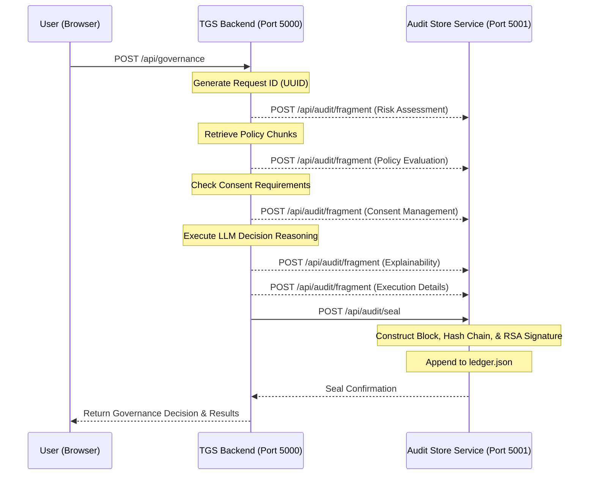

# Implementation Plan: Audit Store Service (ASS)

Implement a dedicated microservice (ASS) responsible for maintaining a cryptographically sealed, immutable, and tamper-evident audit trail of governance decisions made within the Trust & Governance Service (TGS).

---

## Architecture Design

The Audit Store Service (ASS) will run as a separate microservice:
- **Port**: `5001`
- **Data Persistence**: Local JSON ledger file `audit-service/data/ledger.json`
- **Security & Integrity**:
  - Automatically generates an RSA-2048 private/public keypair on first startup.
  - Implements a tamper-evident blockchain-like hash chain. Each block contains:
    - `index`: Index of the audit entry.
    - `timestamp`: Record creation time.
    - `requestId`: The UUID of the TGS governance request.
    - `fragments`: Collected audit fragments (Policy Evaluation, Risk Assessment, Consent Management, Explainability, Execution).
    - `previousHash`: Hash of the previous block.
    - `hash`: SHA-256 hash of: `index + timestamp + requestId + JSON.stringify(fragments) + previousHash`.
    - `signature`: Base64-encoded signature of the `hash` using the service's private RSA key.

### Integration Flow

---

## Proposed Changes

### 1. New Component: Audit Store Service (ASS)

We will create a new microservice in the `audit-service` directory.

#### [NEW] [package.json](file:///c:/Users/vpram/Desktop/bhavya%20tgs/tgs-app/audit-service/package.json)
Contains script and dependencies (`express`, `cors`, `morgan`, `dotenv`).

#### [NEW] [server.js](file:///c:/Users/vpram/Desktop/bhavya%20tgs/tgs-app/audit-service/server.js)
The entry point of the microservice. Handles Express setup, CORS, endpoint routes, and directory/keypair bootstrapping.

#### [NEW] [auditEngine.js](file:///c:/Users/vpram/Desktop/bhavya%20tgs/tgs-app/audit-service/auditEngine.js)
Contains core functions:
- Key generation and loading (`generateOrLoadKeys`).
- Ingesting a single component fragment.
- Consolidating and sealing audit records into a hash chain.
- Reading and verifying the entire ledger's integrity.
- **Tampering Simulation endpoint**: Intentionally mutates a record's data to showcase the tamper-detection capabilities of the cryptographic seal.

---

### 2. Modify Component: TGS Backend

#### [MODIFY] [config.js](file:///c:/Users/vpram/Desktop/bhavya%20tgs/tgs-app/backend/src/config.js)
Add configuration for ASS API endpoint:
- `auditServiceUrl`: Default to `http://localhost:5001`

#### [MODIFY] [governanceEngine.js](file:///c:/Users/vpram/Desktop/bhavya%20tgs/tgs-app/backend/src/governanceEngine.js)
Add hooks to send audit fragments to the ASS. Fragments include:
1. **Risk Assessment**: Request context (user, role, company, query) and CAS score/zone.
2. **Policy Evaluation**: List of retrieved policies matching the query.
3. **Consent Management**: Details on whether any retrieved policies require consent.
4. **Explainability**: Prompt and LLM reasoning results (reason, recommendation).
5. **Execution**: Final decision, timestamp, and performance metrics.

After evaluation completes, trigger the `/api/audit/seal` request to commit the record in the ASS ledger.

---

### 3. Modify Component: TGS Frontend Dashboard

#### [MODIFY] [App.jsx](file:///c:/Users/vpram/Desktop/bhavya%20tgs/tgs-app/frontend/src/App.jsx)
Introduce React-Router paths or Tab state to toggle between the **Governance Request Console** and the **Audit Ledger**.

#### [MODIFY] [AppHeader.jsx](file:///c:/Users/vpram/Desktop/bhavya%20tgs/tgs-app/frontend/src/AppHeader.jsx)
Add navigation buttons/tabs to switch between the Console and the Ledger.

#### [NEW] [AuditLedger.jsx](file:///c:/Users/vpram/Desktop/bhavya%20tgs/tgs-app/frontend/src/pages/AuditLedger.jsx)
A stunning compliance dashboard page showing:
- Real-time ledger status (Total blocks, overall integrity status: green `SECURE` or red `TAMPERED`).
- Verification panel (verifies signature and hash link chain).
- Interactive timeline/list of sealed records.
- Accordion breakdown of all five audit fragments for each transaction.
- **Interactive "Simulate Tampering" button** that corrupts a record's data in the backend database. This demonstrates the tamper-evident validation in real time by turning the ledger status red and pinpointing the corrupted block index.

#### [NEW] [auditApi.js](file:///c:/Users/vpram/Desktop/bhavya%20tgs/tgs-app/frontend/src/api/auditApi.js)
API functions to fetch audit records, trigger validation, and trigger simulation of tampering.

---

## Open Questions

> [!NOTE]
> 1. Is the port `5001` for the Audit Store Service acceptable?
> 2. For the cryptographic seal, RSA-2048 with SHA-256 signature is planned. Let us know if you prefer another algorithm (e.g. ECDSA, HMAC).
> 3. Does the list of 5 audit fragments (Policy, Risk, Consent, Explainability, Execution) cover your expectations?

---

## Verification Plan

### Automated Tests
- Create a test script in `audit-service/test.js` to programmatically verify:
  1. Keypair generation.
  2. Submitting fragments and sealing a block.
  3. Hash chain verification (passing when intact).
  4. Hash chain verification failing after manual data mutation.

### Manual Verification
1. Run both services.
2. Submit a governance request from the frontend.
3. Switch to the **Audit Ledger** tab and verify the transaction appears, is cryptographically checked, and displays all five fragments.
4. Click **Simulate Tampering** on one of the blocks. Verify the UI turns red, showing a `TAMPERED` status and pointing out the compromised block.
5. Click **Re-seal / Reset** to restore the ledger to a healthy state.
